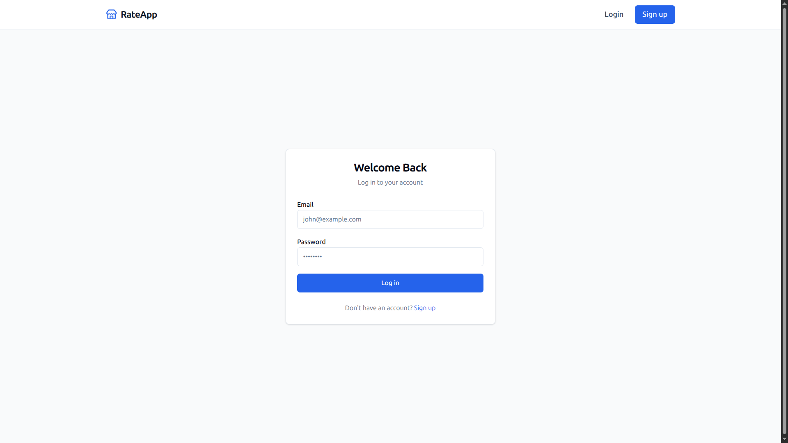
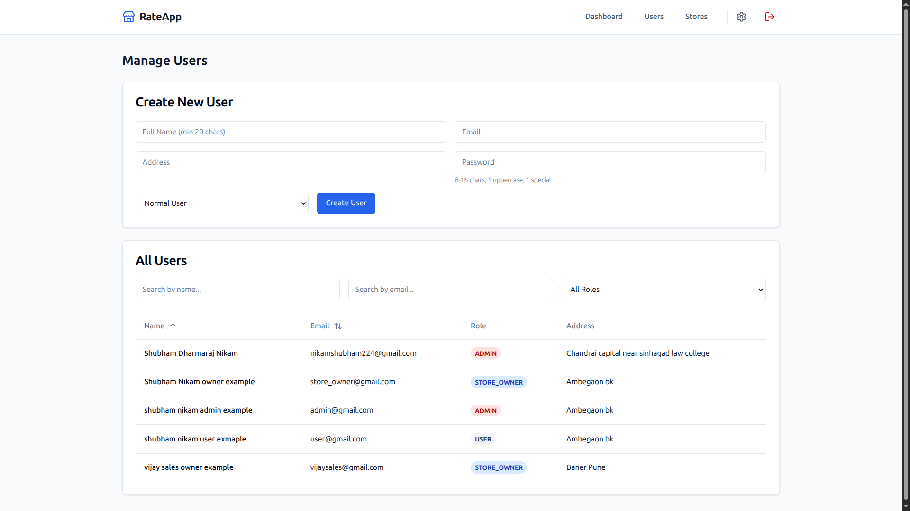
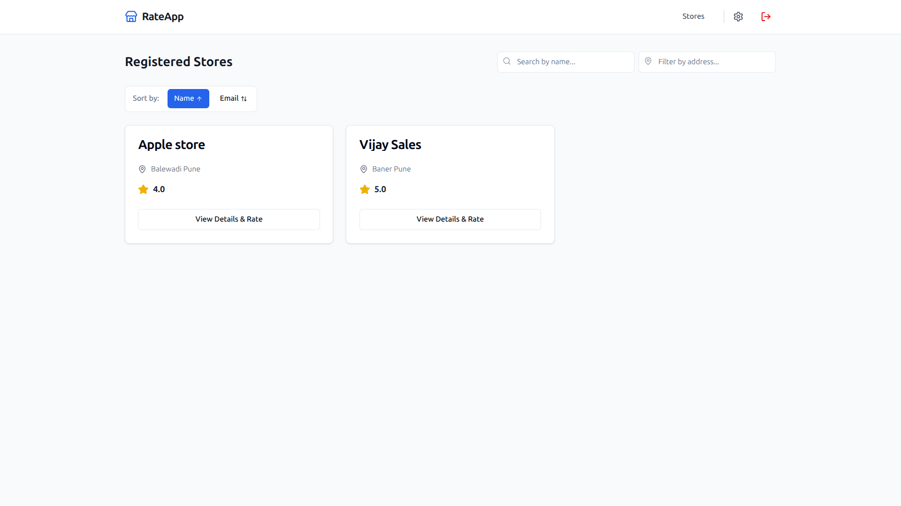
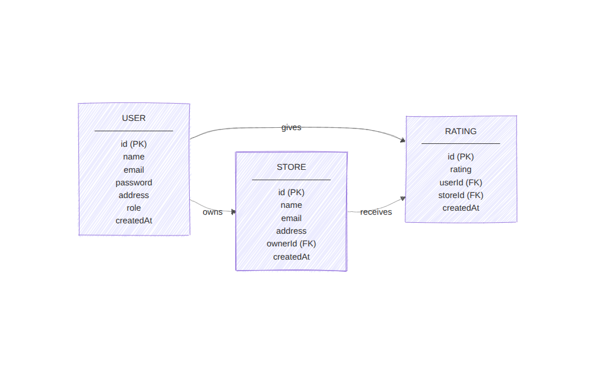

# Roxiler Systems — Full Stack Intern Assignment

A production-ready Full-Stack Store Rating Platform implementing strict Role-Based Access Control (RBAC), secure JWT authentication, and comprehensive analytics dashboards.

## 🚀 Live Deployments
- **Check this out** (Vercel): http://roxiler-systems-one.vercel.app


> **Note to Reviewer:** You can quickly test all RBAC routing capabilities using these live seeded credentials:
> | Role | Email | Password |
> | :--- | :--- | :--- |
> | **Admin** | `admin@example.com` | `Admin@1234` |
> | **Store Owner** | `owner@example.com` | `Owner@1234` |
> | **Normal User** | `user@example.com` | `User@1234` |

## 🛠️ Technology Stack

### Frontend Architecture
- **Core:** React.js + Vite
- **UI & Styling:** Tailwind CSS v4, shadcn/ui custom components
- **Routing:** React Router v6 (with heavily guarded Role-Based Protected Routes)
- **State Handling:** React Query (Server caching), React Context (Auth State)
- **Form Security:** React Hook Form combined with rigorous Zod schema validations

### Backend Architecture
- **Runtime:** Node.js + Express.js
- **Database:** PostgreSQL (Hosted on Neon)
- **ORM:** Prisma ORM
- **Authentication:** Dual-Token system (Memory-bound short-life Access Tokens + `HttpOnly`, `Secure`, `SameSite=none` rotating Refresh Tokens).
- **Validation:** Strict payload validations using Joi schemas.
- **Caching:** `node-cache` applied to heavy Admin dashboard stats.

## 🔐 System Features & RBAC Matrix

The application successfully manages isolated permissions and views for 3 distinct roles:

1. **System Administrator:** 
   - Has access to global analytics dashboards calculating platform health metrics.
   - Fully capable of creating/managing Normal Users, Store Owners, and Stores.
2. **Store Owner:** 
   - Directed specifically to a localized analytics dashboard visualizing their direct raters and overall average rating.
3. **Normal User:** 
   - Allowed to securely browse dynamically sorting/filtering datatables to find specific stores and commit their 1-to-5 star ratings seamlessly via an interactive component.

---
### Visual Previews
*Clean interfaces prioritizing UX across authenticated flows:*

**1. Authentication / Login**


**2. System Admin Dashboard**


**3. Store Listings**

---

## 💾 Database Architecture

The data layout was carefully structured for speed and native constraint protection. The key assignment requirement—**restricting a user to only 1 rating per store**—is inherently protected mathematically at the DB-level via uniquely enforced compound-indexes (`@@unique([userId, storeId])`).



## ⚙️ Local Installation Guide

If you wish to test the functionality locally, clone out the repository and sequentially run:

**1. Database and Server Spin-up:**
```bash
cd backend
npm install
# Configure your local .env containing DATABASE_URL and JWT secrets
npx prisma generate
npx prisma db push
npm run dev
```

**2. Frontend Initialization:**
```bash
cd frontend
npm install
# Configure your local .env with VITE_API_URL=http://localhost:5000/api
npm run dev
```

## 👨‍💻 Engineering Highlights for Code Reviewers
- **Anti-XSS & CSRF Mitigation:** Complete separation of concerns utilizing interceptor-driven rotation tokens. The browser cannot export the refresh token using malicious JS injections.
- **Stale Closure Avoidance:** Standardized React mutable `useRef` bindings successfully wire global `Axios` interceptors.
- **Fail-Safe Reliability:** `React Query` silently manages network race conditions efficiently alongside the 401 interceptor loop-locks. Every endpoint parses input meticulously to avert internal 500 errors.
